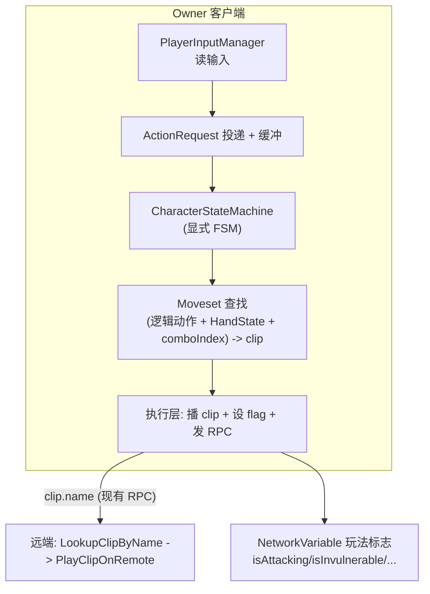
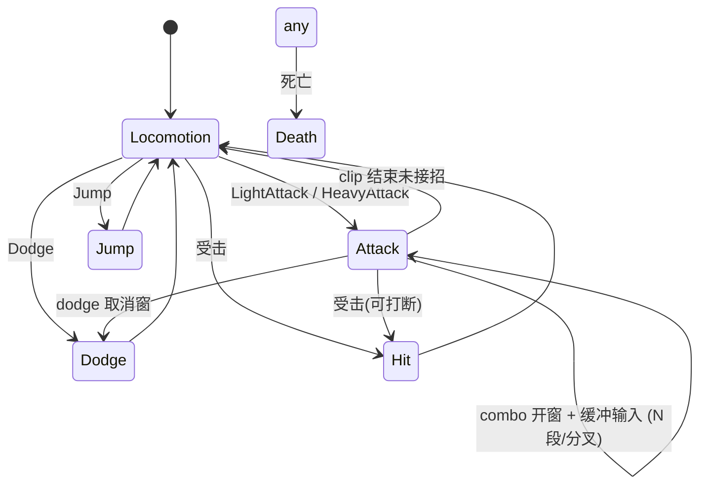
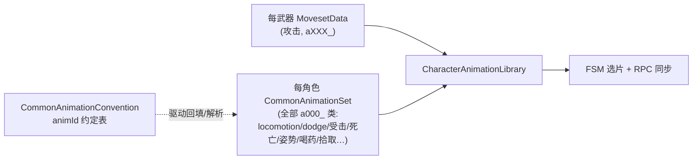

# 战斗系统重构：ER 风格「输入 → 逻辑动作 → 状态机 → 查找动画」

**目标**：把当前隐式、分散的战斗流程，重构为显式状态机（Option B）+ 数据驱动 N 段连招表。
**策略**：绞杀者模式（Strangler）—— 新系统与旧系统并存，用 `useStateMachine` 开关切换，逐武器迁移，每阶段可独立验证，全程不破坏现有联机。

**创建**：2026-06-17 ｜ 维护：架构改动后同步本文件与 `Architecture.md`

---

## 1. 设计原则（关键：让 B 不需要重写 Netcode）

状态机是 **Owner 权威**：只在拥有权客户端上运行并裁决要做什么。
**执行层**（播 clip + 设 `NetworkVariable` 状态标志 + 通过现有 RPC 广播 clip 名）保持不变。
远端客户端仍是「傀儡」，只按广播的 clip 名播放（现有 `LookupClipByName` + `PlayClipOnRemote` 路径）。

> 结论：**不同步状态机本身**，只复用现有的「动画广播 + NetworkVariable 玩法标志」。Netcode 改动趋近于零。



---

## 2. 现状回顾（重构起点）

完整链路（以 RB 轻攻击为例）：

```
RB_Input -> HandleRBInput() -> PerformWeaponBasedAction(weapon.oh_RB_Action, weapon)
  -> WeaponItemAction.AttemptToPerformAction()  // 策略模式 SO
  -> Action 类内硬编码上下文分支(空中/冲刺/翻滚/后撤步/暴击/combo)
  -> 选 AttackType + 取 weaponAnimationSet.lightAttack01
  -> PlayTargetAttackActionAnimation(...)  // 手动设 ~7 个 flag + Animancer + ServerRpc
  -> 隐式状态机: isPerformingAction + _phaseUpdate 单委托 + Animancer OnEnd 回调
```

| 层 | 现状文件 | 问题 |
|----|---------|------|
| 输入 | [PlayerInputManager.cs](Assets/Scripts/Runtime/Character/Player/PlayerInputManager.cs) | 直接调动作分发；输入缓冲是 ad-hoc 的 `que_RB_Input` |
| 分发 | [PlayerCombatManager.cs](Assets/Scripts/Runtime/Character/Player/PlayerCombatManager.cs)、[Weapon Actions/](Assets/Scripts/Runtime/Weapon%20Actions/) | 上下文分支在每个 Action 类里重复；逻辑动作隐式 |
| 状态 | `isPerformingAction`(CharacterManager)、`_phaseUpdate`(AnimatorManager)、一堆 NetworkVariable | 隐式 FSM，单委托互斥，扩展易错 |
| 查动画 | [WeaponAnimationSet.cs](Assets/Scripts/Runtime/Items/Weapons/WeaponAnimationSet.cs) 47 个强类型字段 | 攻击硬引用字段；连招写死 2 段 |

---

## 3. 目标架构

### 3.1 四层职责

| 层 | 新构件 | 职责 |
|----|--------|------|
| 输入指令 | `InputCommand` 枚举 + `ActionRequest` + 输入缓冲 | 把按键翻译成「意图」投递给 FSM，统一缓冲窗口 |
| 逻辑动作 | `HandState` + Moveset 图节点 | 抽象「想做什么」，与具体 clip 解耦 |
| 状态机 | `CharacterStateMachine` + `CharacterState` 派生 | 集中裁决转移、开窗、root motion、flag |
| 查找动画 | `MovesetData`(SO) | (逻辑动作 + HandState + comboIndex) → AnimationClip |

### 3.2 数据驱动 Moveset（替代 WeaponAnimationSet 的攻击字段）

连招建模为**每个 HandState 一张攻击图**（支持 N 段 + 轻/重分叉）：

```csharp
// 一个攻击节点 = 连招中的一击
[Serializable] public struct AttackNode {
    public string  label;          // "R1_1" 编辑器可读
    public AnimationClip clip;
    public AttackType attackType;   // 沿用现有枚举(伤害计算)，按需扩展
    public bool applyRootMotion;

    // 蓄力(重击)：canCharge 时使用后三个 clip
    public bool canCharge;
    public AnimationClip chargeHold, chargeRelease, chargeFullRelease;
    public AttackType chargedAttackType;

    // 数据驱动 N 段 + 分叉：开窗内按输入跳到 nodes[next]，-1 = 连招结束
    public int nextOnLight;
    public int nextOnHeavy;
}

// 一个手持态的完整招式集
[Serializable] public class HandMoveset {
    public AttackNode[] nodes;      // nodes[0..] 扁平图
    public int lightOpener;         // 起手节点 index，-1 无
    public int heavyOpener;
    public int runAttack, rollAttack, backstepAttack, jumpLight, jumpHeavy; // 上下文一次性攻击，index 或 -1
}

[CreateAssetMenu(menuName = "ARPG/Moveset Data")]
public class MovesetData : ScriptableObject {
    public CharacterAnimationData baseAnimData;
    public HandMoveset oneHandRight;
    public HandMoveset twoHand;
    public HandMoveset dualWield;
    public ClipOverride[] locomotionOverrides;   // 沿用现有移动覆盖范式
}
```

**连招推进**：`AttackState` 持有 `currentMoveset` + `comboIndex`。combo 开窗 + 缓冲到对应输入 → `comboIndex = node.nextOnLight/Heavy` → 播 `nodes[comboIndex]`。这就是数据驱动 N 段（R1×4、R1→R2 终结技等都是配数据，不改代码）。

### 3.3 状态机



- `CharacterState` 基类：`OnEnter()` / `CharacterState Tick()`（返回下一状态或 null）/ `OnExit()` / `bool TryConsume(ActionRequest)`。
- `CharacterStateMachine`：持 `currentState`、输入缓冲、`CharacterManager` 引用；`Tick()` 每帧驱动；`ChangeState()` 调 Exit/Enter。
- 首批实现：`LocomotionState`、`AttackState`（含蓄力子阶段）、`DodgeState`、`JumpState`、`HitState`、`DeathState`。法术/弓箭等先留旧路径，后续迁移。

### 3.4 执行层（保持不变，FSM 调用它）

复用 [CharacterAnimatorManager.cs](Assets/Scripts/Runtime/Character/CharacterAnimatorManager.cs) 的 `PlayClipWithAutoReturn` / RPC / `LookupClipByName`。
状态机只负责「决定播哪个 clip、设哪些 flag」，底层播放与广播沿用现有实现。

---

## 4. 编辑器工具：ER「基号 + 偏移」自动回填（解决"9000 配不完"）

ER 动画 FBX 命名 `aXXX_YYYYYY`（= TAE `animId`）。武器 moveset 用「基础 ID + 武器偏移」算出最终 ID。

- 一张全局「逻辑动作槽 → 基号」表（配一次）。
- 每个 `MovesetData` 填：动画文件夹 + 该武器类别偏移量。
- 编辑器按钮 `Auto-Fill From Folder`：按 `(基号 + 偏移)` 拼 `aXXX_YYYYYY`，在文件夹查同名 FBX/AnimationClip 自动填进各节点。
- 复用现有 [AnimationClipRegistryEditor.cs](Assets/Scripts/Editor/Animation/AnimationClipRegistryEditor.cs)、[WeaponAnimationSetEditor.cs](Assets/Scripts/Editor/Animation/WeaponAnimationSetEditor.cs) 的扫描/同步范式。

---

## 5. 分阶段实施（每阶段独立可验证）

| 阶段 | 内容 | 验证 | 风险 | 状态 |
|------|------|------|------|------|
| 0 | 本设计文档 | 评审对齐 | 无 | ✅ 完成 |
| 1 | 基础数据层：`InputCommand`/`HandState` 枚举、`MovesetData`/`HandMoveset`/`AttackNode` | 编译通过、可创建 SO | 无（纯新增） | ✅ 完成 |
| 2 | MovesetData 自动回填编辑器工具 | 一键填出直剑 moveset | 低 | ✅ 完成 |
| 3 | FSM 内核 + `LocomotionState`（owner 端，开关接管移动） | idle/移动经 FSM 与现状一致 | 中 | ✅ 完成 |
| 4 | `AttackState`：N 段连招 + 蓄力 + 开窗 | 轻/重连招、分叉、蓄力释放正确 | 中 | ✅ 完成 |
| 5 | `DodgeState`/`JumpState`/`HitState`/`DeathState`，迁移上下文分支 | 翻滚/跳跃/受击/死亡正确 | 中 | ✅ 完成 |
| 6 | `PlayerInputManager` 投递 `ActionRequest`，开关切换新旧 | 全战斗走 FSM 无回归 | 中高 | ✅ 完成 |
| 7 | 联机验证 + 清理旧 `WeaponItemAction` | 双端表现一致；删死代码 | 中 | 🔶 进行中（开关默认开启；死代码待运行期联机验证后再删） |

### 7.1 Phase 7 联机验证清单（需运行期双端实测）

> FSM 仅 owner 端裁决（`PlayerManager.Update` 开头 `if (!IsOwner) return;`），执行层经
> `NotifyTheServerOfActionAnimationServerRpc(clipName)` 广播、远端 `PlayClipOnRemote` 播放，
> 复制路径与旧系统完全一致，故远端表现正确性等价于「clip 名能否被远端解析」。

- [ ] 主机 + 客户端各持配了 `moveset` 的武器，互相能看到对方的 **轻/重连招** 各段动画。
- [ ] 远端能看到 **蓄力链**（Attack→Hold→Release/FullRelease）、**冲刺攻击**、**跳跃攻击**（Attack→AirIdle→Landing）。
- [ ] 远端能看到 **翻滚/后撤步 + 闪避取消攻击**、**攻击中 dodge/jump 取消**。
- [ ] 受击 / 死亡（`isStaggered`→Hit、`isDead`→Death）双端一致。
- [ ] 确认所有 ER `aXXX_YYYYYY` 攻击 clip 已进 `AnimationClipRegistry`，远端 `LookupClipByName` 能命中（否则远端无动画）。
- [ ] 未配 `moveset` 的武器：开关默认开启下仍走旧 `WeaponItemAction` 路径正常攻击（`ShouldRouteAttackToStateMachine` 门控）。

### 7.2 死代码清理（验证通过后再执行）

`WeaponItemAction`（`oh_RB_Action`/`oh_RT_Action` 等）目前仍是 **fallback**：
未配 `moveset` 的武器、以及 LB/LT/法术/弓箭仍走该路径，**暂不可删**。
待全部武器配齐 `moveset` 且联机清单通过后，再移除 RB/RT 的旧分支与对应 SO。

### 迁移开关
- `WeaponItem` 增 `MovesetData moveset` 字段，与 `weaponAnimationSet` 并存。
- `PlayerManager`/输入层加 `useStateMachine` bool（**Phase 7 起默认 true**）；true 走 FSM，false 走旧路径。
- 攻击路由再加武器门控 `ShouldRouteAttackToStateMachine`：仅当武器配了 `moveset` 才进 FSM，否则回退旧路径——使默认开启对未配置武器安全无回归。
- 逐武器配 `MovesetData` + 验证，稳定后整体切换、删旧路径。

---

## 6. 风险与对策

| 风险 | 对策 |
|------|------|
| FSM 与现有 flag 双写冲突 | 同一时刻只有一条路径生效（开关）；FSM 内统一封装 flag 设置 |
| 联机远端表现错位 | 执行层不变，仍按 clip 名广播；FSM 仅 owner 端 |
| combo 开窗 | 不再用旧 `EnableCanDoCombo` 动画事件；开窗来自 ER TAE 的 Input-Common(flag87) 窗，由 `MovesetAutoFiller` 从 `aXXX.json` 回填到 `AttackNode.comboWindowStart/End`，`PlayerAttackState` 按 clip 播放时间判定（无 TAE 数据回退归一化 [0.35,0.95]） |
| clip 名冲突致远端播错 | 回填工具保证 ER animId 唯一命名；保留 `AnimationClipRegistry` 索引稳定 |
| 数据量大手配累 | 阶段 2 自动回填工具优先做 |

---

## 7. 关联文件

- 输入：[PlayerInputManager.cs](Assets/Scripts/Runtime/Character/Player/PlayerInputManager.cs)
- 分发/连招回调：[PlayerCombatManager.cs](Assets/Scripts/Runtime/Character/Player/PlayerCombatManager.cs)
- 动作 SO：[Weapon Actions/](Assets/Scripts/Runtime/Weapon%20Actions/)
- 执行层：[CharacterAnimatorManager.cs](Assets/Scripts/Runtime/Character/CharacterAnimatorManager.cs)
- 网络：[CharacterNetworkManager.cs](Assets/Scripts/Runtime/Character/CharacterNetworkManager.cs)
- 动画数据：[WeaponAnimationSet.cs](Assets/Scripts/Runtime/Items/Weapons/WeaponAnimationSet.cs)、[CharacterAnimationData.cs](Assets/Scripts/Runtime/Animation/CharacterAnimationData.cs)、[AnimationClipRegistry.cs](Assets/Scripts/Runtime/Animation/AnimationClipRegistry.cs)
- 新增（本重构）：`Assets/Scripts/Runtime/Combat/` 下 FSM 与 Moveset 数据

---

## 8. ER 动画资源架构（选片 / 查找 / RPC / 内存）

> 背景：ER 动画总量上万（Player c0000 已 9000+，外加 c2120 玛莲妮娅等角色尚未导入）。
> 原"一个全局 `AnimationClipRegistry` 硬引用所有 clip + 按 `clip.name` 字符串走 RPC"的方案在此规模下有
> **三个硬伤**：①全局表硬引用导致所有 clip 全程常驻内存、无法卸载；②跨角色 `aXX_YYYYYY` 重名 → 远端按名查找会串；③字符串 payload 又长又脆。
> 本节定义在 ER 框架内可持续的方案。**不再考虑旧自制动画。**

### 8.1 三个约束

1. **选片**：FSM 据逻辑动作 → 一个具体动画 → `AnimationClip` 喂 Animancer。
2. **远端同步**：owner 决策后让其它客户端播同一动画，payload 要小、要稳、不撞名。
3. **内存**：上万 clip 不可能全程常驻；任意时刻只加载"当前用得到的一小撮"。第 3 条否决"全局大表硬引用所有 clip"。

### 8.2 核心标识：`(chrId, animId)`，照搬 ER

ER 每个动画天然有两个 int 身份：角色 `chrId`（c**0000** / c**2120**）+ 角色内唯一的 `animId`（`aXX_YYYYYY`）。

- **RPC 只传 `animId`（int）**：RPC 挂在角色 NetworkBehaviour 上，接收端本就知道是哪个角色 → 知道 `chrId`。
- **撞名彻底消失**：查找按角色作用域 `(chrId 已知) + animId`，各角色各查各表。
- 本项目 `animId = wepMotionCategory * 1_000_000 + (baseSlot + suffix)`，例 `a023_030000 → 23030000`。
  由 `MovesetAutoFiller` 回填进 `AttackNode.animId`（见 `MovesetSlotConvention.ComposeAnimId`）。

### 8.3 两档实现，按角色规模选

判据：**任何被序列化的字段硬引用了 `AnimationClip`，该资产一加载，clip 就进内存。** 懒加载的本质 = 热路径上不硬引用 clip。

**档位 A —— 玩家武器 moveset（当前落地）**：一把武器 moveset 也就几十个 clip，让 `MovesetData` 硬引用可接受。
- 武器 SO 被装备 → 它的 moveset + 那几十个 clip 才加载。
- 远端复用同一份数据：装备状态是 NetworkVariable，远端也加载同一武器 SO → 同一份 moveset clip 已在内存。
- 任意时刻内存 = (在场角色数) × (通用集 + 已装备武器集)，几十~几百，不是上万。**全局表可弃用。**

**档位 B —— Boss / 角色专属大动作集（如 Malenia 几千，后续）**：
- `MovesetData` / 角色数据不再硬引用 clip，改存 `animId` + Addressable 地址（`c{chrId}_a{animId}` 推导或表存 `AssetReference`）。
- 运行期引用计数缓存按需 `LoadAsync(animId)`，按"阶段/招式组"预加载、用完释放。
- 预加载由**复制的状态**（装备 / Boss 阶段）驱动，非攻击 RPC 驱动；RPC 到达时若未就绪则 load-then-play 兜底。

### 8.4 运行期解析服务 `CharacterAnimationLibrary`（每角色一个）

```
FSM(选 animId) → CharacterAnimationLibrary(animId/name → clip) → 执行层(Animancer 本地播 + RPC(animId) 广播)
                                                                    ↑ 远端: RPC(animId) → 同一 Library 解析 → 播
```

- 数据来源：通用集来自 `CharacterAnimationData`（反射其 `AnimationClip` 字段），武器集来自当前 `WeaponItem.moveset`。
- owner 选片、远端收 RPC 都经此**同一** Library 解析，按角色作用域天然避开跨角色重名。
- 对外接口 `TryGetByName` / `TryGetByAnimId` / `RegisterMoveset` / `RegisterClipFields`；档位 B 只换内部为 Addressables 异步，对外不变。
- 预加载点：`PlayerEquipmentManager.LoadRightWeapon`（owner + 远端都跑，由复制的 `currentRightHandWeaponID` 驱动）注册当前武器 moveset。

### 8.5 落地阶段

| 步 | 内容 | 状态 |
|----|------|------|
| A1 | `AttackNode` 增 `animId`；`MovesetAutoFiller` 回填 | 🔶 进行中 |
| A2 | 新建 `CharacterAnimationLibrary`（按角色作用域），替换反射版 `_clipLookup` 与全局表兜底；装备时注册 moveset | 🔶 进行中 |
| A3 | 攻击 RPC 增按 `int animId` 变体（`NotifyTheServerOfAttackActionAnimationByIdServerRpc`）；发送端按 clip 反查 animId，有则走 id RPC、无则回退 name RPC（旧路径过渡用） | ✅ 完成 |
| A4 | 远端按复制的装备状态预加载 moveset（已随 A2 落地）；待联机验证后移除全局 `AnimationClipRegistry` 依赖与 name RPC | ⬜ 待办 |
| B  | Addressables 懒加载（Boss / 角色专属大集）；`MovesetData` 改 animId + 地址引用 | ⬜ 后续 |

### 8.6 通用动画（`a000_`）接入：locomotion + dodge（档位 A）

ER 通用动作（idle / 行走 / 翻滚 / 后撤步 等）总量上万，但运行时工作集很小，且命名高度规律。强类型的 `CharacterAnimationData` 字段不可扩展，故改为约定驱动 + 自动回填 + 运行时解析（与 `MovesetData` 同构）。

**ID 三段编码**（权威来源：`Assets/_ELDENRING_REF/ER-Animation-Category-Reference.md` §6.0）：

```
animId = stance * 1_000_000 + (actionBase + load*10 + direction)
```

- **stance（姿态前缀 `aXXX`）**：由「握持(单/双手) + 武器大类」决定，不是 `a000` 内的子号。如单手轻型=`a000`、双手轻型=`a010`、单手重型=`a002`、双手长柄=`a013`…（枚举 `CommonStance`，整型值即类别号）。
- **load（负重）**：十位 ×10，**仅 3 档**：轻=0 / 中=10 / 重=20。
- **direction（方向）**：个位 +0..3：前0 / 后1 / 左2 / 右3。

该式与 `MovesetSlotConvention.ComposeAnimId`（前缀=category）同构，多前缀天然由 `CharacterAnimationLibrary` 按 animId 区分。**权威表的两个例外**：翻滚固定 `a000` 前缀（不随姿态变，`CommonStance.RollStance`）；后撤步 / locomotion 随姿态前缀变。

| 步 | 内容 | 状态 |
|----|------|------|
| C1 | `CommonAnimationConvention`（ID 约定）+ `CommonAnimationSet`（每角色回填子集）+ `CommonAnimationAutoFiller`（编辑器）；`CharacterAnimationLibrary.RegisterCommonSet`；`CharacterAnimationData` 加 `commonConvention`/`commonSet` 引用并在 `Start` 注册 | ✅ 完成 |
| C2 | `PlayerLocomotionManager.AttemptToPerformDodge` 改为按约定 animId 从库解析 roll/backstep（未配回退旧 `rollForward`/`backstep`） | ✅ 完成 |
| C3 | `CharacterAnimatorManager.BuildCommonLocomotionMixer`：运行时构建方向性 locomotion 混合树（idle/四向走/四向慢跑/前向奔跑，阈值 ER 约定），非格挡时替换手搓 `MixerTransition2D`；核心 clip 缺失自动回退 animData | ✅ 完成（待运行期实测移动手感/联机） |
| C4 | **姿态前缀（`aXXX`）接入**：`Compose` → `ComposeId(stance,base,load,dir)`；新增 `CommonStance`/`CommonStanceClass` 枚举 + `ResolveStanceCategory(twoHanding, weaponClass)` + `FromWeaponClass`；负重收敛为 3 档常量。回填器按「姿态×负重(0-2)×方向」枚举并存完整 animId；locomotion/dodge **运行时按握持+武器大类选前缀**（`GetWeaponStanceClass` 虚方法 + 玩家读右手武器；后撤步用当前姿态、翻滚固定 `a000`）。混合树缓存键改 `(stance, 负重组)` | ✅ 完成 |

**运行时选前缀数据源**：握持 = `GetIsTwoHanding()`（玩家读 `isTwoHandingWeapon`）；武器大类 = `CharacterAnimatorManager.GetWeaponStanceClass()`（玩家读 `currentRightHandWeapon.weaponClass` 经 `FromWeaponClass` 归并）。基类默认轻型，AI 可按需重写。

> ⚠️ **回填资产需重跑**：旧回填器存的是后缀号（如 `27000`）。对 `a000`（stance=0）「完整 animId == 后缀」，故现有 1H 直剑的走/滚/后撤步仍命中、不退化；但要让 `a010` 等其它姿态生效，须重跑一次 `Tools → Moveset → Common Animation Filler` 重新生成 `CommonAnimationSet`（扫进带前缀的 `a010_…` 等 clip）。

未覆盖（按需后续）：负重档当前统一用 `defaultLoadGroup`（接入负重系统后改由角色状态提供）；左手/双持武器大类细分（暂统一取右手）；格挡 locomotion；hit/parry/backstab 等未记录动作仍走 `CharacterAnimationData` 强类型字段。

相关文件：[CommonAnimationConvention.cs](Assets/Scripts/Runtime/Animation/CommonAnimationConvention.cs)、[CommonAnimationSet.cs](Assets/Scripts/Runtime/Animation/CommonAnimationSet.cs)、[CommonAnimationAutoFiller.cs](Assets/Scripts/Editor/Animation/CommonAnimationAutoFiller.cs)、[ER-Animation-Category-Reference.md](Assets/_ELDENRING_REF/ER-Animation-Category-Reference.md)（§6 编码规则）。

### 8.7 终态：全量 animId 化 + `CharacterAnimationData` 瘦身为 Profile

**背景**：角色骨架/模型/动画已全面切到 ER，旧动画与 ER 骨架不匹配，**不再需要回退旧动画路径**。当前 [CharacterAnimationData.cs](Assets/Scripts/Runtime/Animation/CharacterAnimationData.cs) 是 ~80 个强类型 `AnimationClip` 字段的大杂烩，而其中绝大多数动作在 ER 里本就是 `a000_` 类、本来就有 animId。强类型字段扩展不到上万，必须收口到 animId。

**终态数据模型**：一切动画按 `animId` 经 [CharacterAnimationLibrary](Assets/Scripts/Runtime/Animation/CharacterAnimationLibrary.cs) 解析，只两个数据源：



`CharacterAnimationData` 退化为薄 **Profile**：只留没有 animId 的配置 —— `commonConvention`、`commonSet`、`AvatarMask`（upperbody/pingDamage）、层配置。所有 clip 字段迁走。

> 内存说明：`commonSet` 是 SO **引用**，嵌不嵌进 `CharacterAnimationData` 都不影响内存；真正决定内存的是 `CommonAnimationSet` 收了多大子集（每角色工作集约一两百，远小于上万全表）。

**Strangler 迁移（4 阶段，按已知 animId 优先）**：

| 阶段 | 范围 | animId 状态 | 状态 |
|----|------|------|------|
| P1 | locomotion / idle / dodge **彻底 ER 化、去旧回退** | 已知（walk 20000 / jog 20100 / run 20200 / roll 27100 / backstep 27000） | 进行中 |
| P2 | 受击（hit/flinch）/ 死亡（death） | **待确认**（先在约定留 `Unset` 占位） | 待办 |
| P3 | 姿势（emote `a000_08xxxx`）/ 喝药 / 法术 / 拾取 / 换武 | 部分已知（emote 列表已有） | 待办 |
| P4 | 收尾：`CharacterAnimationData` 砍成 Profile，移除强类型 clip 字段与反射 `RegisterClipFields` | — | 待办 |

**P1 落地细节（本次）**：
- 迁移采用「按角色」的 strangler 闸门：`CharacterAnimationData.commonConvention != null` 即视为**已迁移角色**，其非格挡 locomotion/idle **只走 ER 通用系统、不回退旧 clip**；缺数据时 `warn-once` 并跳过（不再用旧动画掩盖缺数据）。未挂 `commonConvention` 的角色（尚未迁移的 AI）仍走旧路径。
- `InitLocomotion` 在 `commonConvention` 存在时即启用 locomotion，不再依赖 `idle1H`/`locomotion1H` 这些遗留字段是否赋值。
- `BuildCommonLocomotionMixer` 去掉 `idle ??= animData.idle1H` 的旧回退。
- 格挡 locomotion 的 ER id 暂未知，**暂留旧路径**（归入 P2/P3 后续）。

**P2+ 占位**：在 `CommonAnimationConvention` 增加受击/死亡等基址字段，默认 `IdleUnset(-1)` 表示「待确认」；消费方（`TakeDamageEffect`/`ProcessDeathEvent`）暂不改，待 id 确认后再像 locomotion 一样接入并去旧字段。

相关文件（终态新增/改动）：上列通用动画文件 + [CharacterAnimatorManager.cs](Assets/Scripts/Runtime/Character/CharacterAnimatorManager.cs)（locomotion 驱动）、[CharacterAnimationData.cs](Assets/Scripts/Runtime/Animation/CharacterAnimationData.cs)（最终瘦身）、[TakeDamageEffect.cs](Assets/Scripts/Runtime/Effects/TakeDamageEffect.cs) 与 [CharacterManager.cs](Assets/Scripts/Runtime/Character/CharacterManager.cs)（P2 受击/死亡消费方）。
